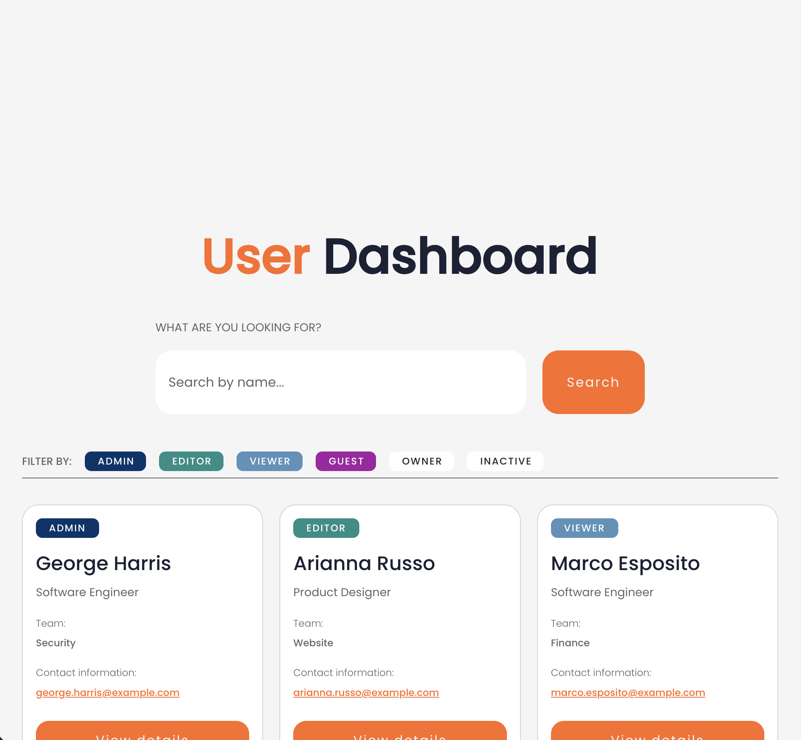

# User Dashboard - Prima Technical Challenge

A production-ready search and filtering application built with React 19, TypeScript, and custom CSS. This implementation demonstrates a quality-focused approach, prioritising depth over breadth.



> Following Prima's guidance to "focus on one part and do it well", I prioritised code quality, comprehensive testing, responsive design, and accessibility over completing all requirements. The user detail modal was intentionally omitted to allow deeper focus on architecture, testing, and polish.

## Features

- **Realistic search**: Case-insensitive name filtering
- **Multi-select filtering**: Permission-based filtering with OR logic
- **Responsive grid**: Fluid layout adapting from mobile to desktop with container queries
- **State persistence**: localStorage for search and filters across page reloads
- **Error handling**: Loading, empty, and error states with retry capability (simulated)
- **Progressive sticky controls**: Search and filters become sticky on scroll
- **Full keyboard navigation**: Complete accessibility with ARIA attributes
- **Microinteractions**: Smooth transitions, press states, on-brand focus rings

## Architecture & Technical Implementation

- **Feature-based architecture** combined with **atomic design** (atoms → molecules → organisms → templates):

```text
src/
├── features/users/          # User dashboard feature (components, context, hooks, utils, types)
├── components/              # Global reusable components (atomic design hierarchy)
├── hooks/                   # useAsync, useAsyncFiltered, useLocalStorage
└── index.css                # 180+ design tokens
```

- **State management**: Context API + custom hooks for async data, filtering, and localStorage persistence
- **Styling**: Custom CSS with comprehensive design token system (180+ properties). 23 CSS files with component-scoped styles, container queries, and brand-consistent selection/focus colours. No utility frameworks.
- **Testing**: 20 test files with focus on integration tests for complete user journeys ([620-line integration test suite](src/features/users/components/templates/UserDashboardPage/UserDashboardPage.integration.test.tsx)). Unit tests for components, hooks, and utilities. Vitest + React Testing Library.

## Quality Focus Areas

- **Responsiveness**: Mobile-first with multiple breakpoints, container queries, and fluid grid system (`auto-fit` + `minmax`)
- **Code Organisation**: Feature-based architecture, atomic design, comprehensive JSDoc, early returns pattern for type narrowing
- **Testability**: 20 test files with focus on integration tests for user journeys. Edge cases covered (empty states, errors, persistence)
- **Accessibility**: Full keyboard navigation, ARIA attributes, semantic HTML, focus management, screen reader support
- **Progressive Enhancement**: CSS-only sticky controls
- **Microinteractions**: Smooth and snappy transitions (150-300ms), press states (0.97x scale), hover effects
- **Design Details**: On-brand selection colours (`#fb6232`), focus rings with 2px offset, 8px spacing scale, comprehensive typography scale

## Key Technical Decisions

- **No utility libraries**: Custom CSS with 180+ design tokens demonstrates ability to build maintainable, scalable styling systems
- **Feature-based organisation**: Based on my experience, it scales better than flat structures. Each feature encapsulates components, hooks, utilities, and types
- **Custom async hooks**: [`useAsync`](src/hooks/useAsync.ts) and [`useAsyncFiltered`](src/hooks/useAsyncFiltered.ts) simulate realistic loading/error states applicable to real API integration
- **LocalStorage persistence**: Type-safe [`useLocalStorage`](src/hooks/useLocalStorage.ts) hook with cross-tab synchronisation
- **Integration testing**: Focus on user journeys rather than isolated units. More resilient to refactoring and catches real-world issues

## What Was Not Implemented

**User detail modal** was intentionally omitted following Prima's guidance to "focus on one part and do it well". This allowed deeper focus on responsive design, architecture, testing strategy, accessibility, and polish rather than surface-level completeness.

## Getting Started

```bash
# Install dependencies
pnpm install

# Development server
pnpm dev

# Run tests
pnpm test

# Type check
pnpm tsc

# Lint and format
pnpm check
pnpm check:fix
```

## Technology Stack

- **React 19** + **TypeScript 5.9** (strict mode)
- **Vite 7.2** (build tool) + **Vitest 4.0** (testing)
- **React Testing Library** + **@testing-library/user-event**
- **Biome 2.3** (linter + formatter)
- **Custom CSS** with 180+ design tokens (no utility frameworks)

## Code Quality

- **TypeScript strict mode** with comprehensive JSDoc documentation
- **Biome linting** (2 spaces, double quotes, 100 char lines)
- **Early returns pattern** for better type narrowing
- **Functional programming** principles (immutability, pure functions)
- **Custom quality rules** in `.cursor/rules/` directory

## Design Tokens

Design token system in [`src/index.css`](src/index.css) covering colours, spacing (8px base unit), typography scale, transitions, and accessibility (focus outlines, selection colours).

## Figma Implementation

Design implemented following [Figma specifications](https://www.figma.com/design/ESP3mNtKRj1aI458c08QBb/%F0%9F%92%BB-Website-Home-Test?node-id=0-1&t=tmrCaYq4wADJCHvD-1) with pixel-perfect spacing, tokenised colours, and extended responsive behaviour beyond desktop-only designs.

---

**Built with attention to detail, tested thoroughly, and crafted for production.**
